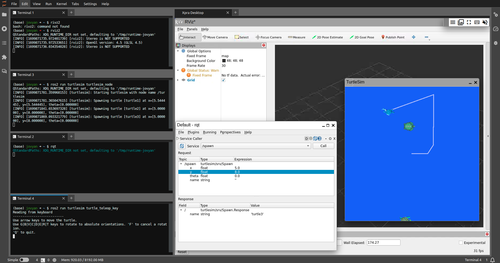

# Docker image of ROS2 on Jupyterhub/Binderhub

[](https://hub.docker.com/r/intel4coro/base-notebook/tags)
[](https://binder.intel4coro.de/v2/gh/IntEL4CoRo/docker-stacks.git/ros-iron)

`intel4coro/base-notebook:py3.10-ros-iron`  is a ready-to-run ROS2 Docker image built on top of jupyter image [jupyter/minimal-notebook:python-3.10](https://jupyter-docker-stacks.readthedocs.io/en/latest/using/selecting.html#jupyter-minimal-notebook) , contains the following main softwares:

- [ros-iron-desktop](https://docs.ros.org/en/iron/index.html): Desktop install of ROS, RViz, demos, tutorials.
- [Jupyterlab 4.0](https://github.com/jupyterlab/jupyterlab): Web-based integrated development environment (IDE)
- [XPRA Remote Desktop](https://github.com/Xpra-org/xpra): Virtual Display to display GUI applications on web browser
- [Webots ROS2 Interface](https://github.com/cyberbotics/webots_ros2): Package that provides the necessary interfaces to simulate a robot in the [Webots](https://cyberbotics.com/) Open-source 3D robots simulator.
- [Gazebo Classic](http://classic.gazebosim.org/): Classic Robotic Simulator



## Quick Start

Start [ROS2 Iron tutorials](https://docs.ros.org/en/iron/Tutorials.html) on Binderhub: [](https://binder.intel4coro.de/v2/gh/IntEL4CoRo/docker-stacks.git/ros-iron)

>Note: Please start the "Xpra Desktop" in the JupyterLab Launcher to initiate the virtual display before you run GUI applications.

## Build environments for your git Repo

To build your own ROS2 environment based on this image to run your open source code, you need to create a `Dockerfile` under the root path or directory `binder/` in your git repository.

### Example of Dockerfile

```Dockerfile
FROM intel4coro/base-notebook:py3.10-ros-iron

# Define environment variables
ENV MY_ROS_WS=/home/${NB_USER}/my-ros-workspace

# Change working directory (similar to command "cd")
WORKDIR ${MY_ROS_WS}

# Run bash command
RUN {{ Initiate ROS workspace }}
RUN pip install vcs catkin_tools

# Run bash commands required root permission
USER root
RUN apt update && apt install nano vim
USER ${NB_USER}

# Copy files from your git repo
COPY --chown=${NB_USER}:users . ${MY_ROS_WS}/src/my-repo-name

# Override the entrypoint to add startup scripts, (e.g., source your ROS workspace)
# Note: Do not forget to add `exec "$@"` at the end of your entrypoint.
COPY --chown=${NB_USER}:users entrypoint.sh /
ENTRYPOINT ["/entrypoint.sh"]
```

## Development

The config of running the docker image on your machine locally is specify in [docker-compose.yml](./docker-compose.yml).

> Note: The configs in [docker-compose.yml](./docker-compose.yml) will not take effect in the Binderhub.

### Run Image Locally (Under repo directory)

- Run Docker image

  ```bash
  docker compose up
  ```

- Open Web browser and go to http://localhost:8888/

- Force image rebuild

  ```bash
  docker compose up -d --build 
  ```

#### Enable nvidia GPU and display on local machine

To display GUI applications on your host machine instead of a Xpra virtual display. uncomment the following configs in [docker-compose.yml](./docker-compose.yml)

```docker-compose
    #   - /tmp/.X11-unix:/tmp/.X11-unix:rw
    # environment:
    #   - DISPLAY
    #   - NVIDIA_DRIVER_CAPABILITIES=all
    # deploy:
    #   resources:
    #     reservations:
    #       devices:
    #         - driver: nvidia
    #           count: all
    #           capabilities: [gpu]
```

and run `docker compose up` with X-forwarding:

```bash
xhost +local:docker && \
docker compose up && \
xhost -local:docker
```

## Simulators

### Webots ROS2

> Note: Webots is super performance intensive, better to run it with GPU enabled.

- To Launch Multirobot Example:

  ```base
  ros2 launch webots_ros2_universal_robot multirobot_launch.py
  ```

- Type "Y" to install Webots automatically.


See [Webots - ROS2 documenation](https://docs.ros.org/en/iron/Tutorials/Advanced/Simulators/Webots/Setting-Up-Simulation-Webots-Basic.html) for more details and github repo [cyberbotics/webots_ros2](https://github.com/cyberbotics/webots_ros2/wiki/Examples) for more examples.

### Gazebo classic

>Note: Unfortunately the Gazebo classic doesn't work on our BinderHub server.

Copy demos to directory `gazebo_worlds_demo`

```base
cp -R /opt/ros/${ROS_DISTRO}/share/gazebo_plugins/worlds /home/jovyan/gazebo_worlds_demo
```

Explaination of these demos can be found at the beginning of the `*.world` files.

Launch demo:

```bash
gazebo --verbose gazebo_ros_joint_pose_trajectory_demo.world
```


## License

Copyright 2023 IntEL4CoRo\<intel4coro@uni-bremen.de\>

This repository is released under the Apache License 2.0, see [LICENSE](./LICENSE).  
Unless attributed otherwise, everything in this repository is under the Apache License 2.0.

### Acknowledgements

This Docker image is based on [jupyter/docker-stacks](https://github.com/jupyter/docker-stacks), licensed under the [BSD License](https://github.com/jupyter/docker-stacks/blob/main/LICENSE.md).

Gazebo example referneces [Tiryoh/docker-ros2-desktop-vnc](https://github.com/Tiryoh/docker-ros2-desktop-vnc), licensed under the [Apache License 2.0](https://github.com/Tiryoh/docker-ros2-desktop-vnc/blob/master/LICENSE).
